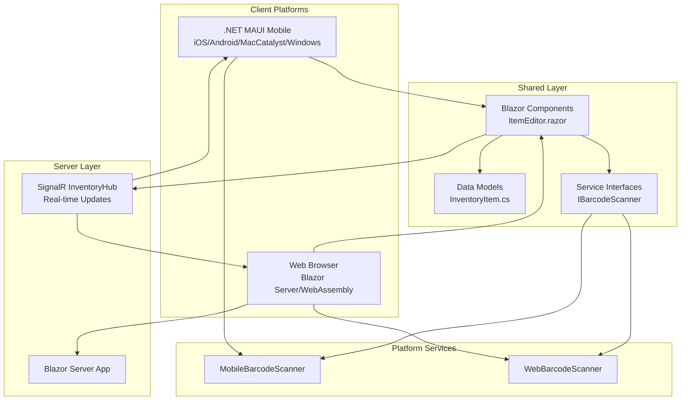

# SmartWarehouse

A cross-platform warehouse management application built with .NET MAUI and Blazor, supporting mobile (iOS, Android, MacCatalyst) and web platforms.

## 🚀 Features

- **Cross-Platform Mobile App** - Native iOS, Android, MacCatalyst, and Windows applications built with .NET MAUI
- **Web Application** - Blazor Server and WebAssembly support with interactive render modes
- **Real-time Inventory Updates** - SignalR hub broadcasts inventory changes to all connected clients in real-time
- **Platform-Adaptive Barcode Scanning** - Abstracted interface with native mobile and web implementations
- **Shared UI Components** - Blazor components shared across mobile and web platforms for consistent UX
- **Form Validation** - DataAnnotations-based validation for inventory items with client-side and server-side validation
- **Connection Resilience** - Automatic reconnection handling for SignalR connections with user-friendly modal dialogs
- **State Persistence** - .NET 10 PersistentState feature for seamless server-to-client state handoff

## 🏗️ Architecture

SmartWarehouse follows a multi-platform architecture that maximizes code reuse while providing platform-specific optimizations.

### Multi-Platform Architecture

The application consists of three main projects:

- **SmartWarehouse.Mobile** - .NET MAUI application targeting iOS, Android, MacCatalyst, and Windows platforms
- **SmartWarehouse.Web** - Blazor Server and WebAssembly web application
- **SmartWarehouse.Shared** - Shared library containing reusable Blazor components, models, and service interfaces

### Component Model

The shared component model allows UI components to be written once and run on both mobile and web platforms:

- **Shared Blazor Components** - Components in `SmartWarehouse.Shared/Components` are used across all platforms
- **Platform-Specific Services** - Services implement shared interfaces (e.g., `IBarcodeScanner`) with platform-specific logic
- **Dependency Injection** - Platform-specific implementations are registered at application startup

### Real-Time Synchronization

SignalR `InventoryHub` enables real-time inventory updates:

- Clients connect to the hub for bidirectional communication
- Inventory changes are broadcast to all connected clients (excluding the sender)
- Automatic reconnection handling ensures reliable connectivity

### Platform-Specific Implementations

The application uses abstraction patterns for platform-specific features:

- **Barcode Scanning**: `IBarcodeScanner` interface with implementations:
  - `MobileBarcodeScanner` - Mobile platform implementation
  - `WebBarcodeScanner` - Web platform implementation using JavaScript interop

### .NET 10 Features

The application leverages .NET 10 capabilities:

- **PersistentState** - Automatically persists component state during server-to-client handoff, eliminating double-fetching
- **Interactive Render Modes** - Supports both Blazor Server and WebAssembly render modes
- **Nullable Reference Types** - Type safety enabled throughout the codebase

### Architecture Diagram



## 📋 Prerequisites

### Required
- **.NET SDK 10.0** or later ([Download](https://dotnet.microsoft.com/download))
- **Git**

### Platform-Specific Requirements

#### macOS (for iOS/MacCatalyst/Android)
- **Xcode 26.2** or later ([App Store](https://apps.apple.com/us/app/xcode/id497799835))
- **Java SDK 17** (Microsoft OpenJDK 17 recommended)
- **Android SDK** (for Android development)

#### Windows (for Windows/Android)
- **Visual Studio 2022** with .NET MAUI workload
- **Windows SDK**

> 📖 **Detailed Setup Instructions:** See [Environment Setup Guide](docs/environment-setup.md) for complete installation and configuration steps.

## 🛠️ Quick Start

### 1. Clone the Repository
```bash
git clone <repository-url>
cd smartwarehouse
```

### 2. Install .NET MAUI Workload
```bash
# macOS/Linux
sudo dotnet workload install maui

# Windows
dotnet workload install maui
```

### 3. Restore Dependencies
```bash
dotnet restore
```

### 4. Build the Solution
```bash
dotnet build
```

### 5. Run the Application

**Mobile (iOS - macOS only):**
```bash
dotnet build SmartWarehouse.Mobile/SmartWarehouse.Mobile.csproj -f net10.0-ios26.2
# Then run from Xcode or IDE
```

**Mobile (MacCatalyst - macOS only):**
```bash
dotnet build SmartWarehouse.Mobile/SmartWarehouse.Mobile.csproj -f net10.0-maccatalyst26.2
# Then run from IDE
```

**Mobile (Android):**
```bash
dotnet build SmartWarehouse.Mobile/SmartWarehouse.Mobile.csproj -f net10.0-android
# Then run on emulator or device
```

**Web:**
```bash
cd SmartWarehouse.Web/SmartWarehouse.Web
dotnet run
```

Navigate to `https://localhost:5001` or `http://localhost:5000`

## 📁 Project Structure

```
SmartWarehouse/
├── SmartWarehouse.Mobile/          # .NET MAUI mobile application
│   ├── Components/                 # Blazor components for mobile
│   │   ├── Pages/                  # Mobile-specific pages
│   │   └── Routes.razor            # Routing configuration
│   ├── Platforms/                  # Platform-specific implementations
│   │   ├── Android/                # Android platform code
│   │   ├── iOS/                    # iOS platform code
│   │   ├── MacCatalyst/            # MacCatalyst platform code
│   │   └── Windows/                # Windows platform code
│   ├── Resources/                  # App icons, images, fonts
│   ├── Services/                   # Mobile-specific services
│   │   └── MobileBarcodeScanner.cs # Mobile barcode scanner implementation
│   ├── MauiProgram.cs             # MAUI app configuration and DI setup
│   └── SmartWarehouse.Mobile.csproj
│
├── SmartWarehouse.Shared/          # Shared components and models
│   ├── Components/                 # Reusable Blazor components
│   │   ├── Layout/                 # Layout components (MainLayout, NavMenu, ReconnectModal)
│   │   └── Pages/                  # Shared pages
│   │       ├── ItemEditor.razor    # Inventory item editor with barcode scanning
│   │       └── Counter.razor      # Example counter component
│   ├── Models/                     # Data models
│   │   └── InventoryItem.cs        # Inventory item model with validation
│   ├── Services/                   # Shared services/interfaces
│   │   └── IBarcodeScanner.cs      # Barcode scanning abstraction interface
│   └── SmartWarehouse.Shared.csproj
│
├── SmartWarehouse.Web/             # Web application
│   ├── SmartWarehouse.Web/         # Blazor Server project
│   │   ├── Components/             # Server-side components
│   │   │   ├── Pages/              # Web pages (Home, Weather, Error, NotFound)
│   │   │   └── Layout/             # Layout components
│   │   ├── Hubs/                   # SignalR hubs
│   │   │   └── InventoryHub.cs     # Real-time inventory update hub
│   │   └── Program.cs              # Web app configuration and SignalR setup
│   └── SmartWarehouse.Web.Client/  # Blazor WebAssembly project
│       └── Services/               # Client-side services
│           └── WebBarcodeScanner.cs # Web barcode scanner implementation
│
├── docs/                           # Documentation
│   └── environment-setup.md        # Environment setup guide
│
└── SmartWarehouse.sln             # Solution file
```

## 🎯 Target Frameworks

| Project | Target Frameworks |
|---------|------------------|
| **SmartWarehouse.Mobile** | `net10.0-android`, `net10.0-ios26.2`, `net10.0-maccatalyst26.2`, `net10.0-windows10.0.19041.0` |
| **SmartWarehouse.Shared** | `net10.0` |
| **SmartWarehouse.Web** | `net10.0` |
| **SmartWarehouse.Web.Client** | `net10.0` |

## 📦 Key Dependencies

- **.NET MAUI** 10.0.0 - Cross-platform mobile framework
- **ASP.NET Core** 10.0.1 - Web application framework
- **Blazor** 10.0.1 - Web UI framework with Server and WebAssembly render modes
- **SignalR** - Real-time bidirectional communication (included in ASP.NET Core)
- **Microsoft.Extensions.Logging.Debug** 10.0.0 - Debug logging provider
- **Data Annotations** - Form validation (included in .NET)
- **Dependency Injection** - Service registration and resolution (included in .NET)

## 🔧 Development

### Building Specific Platforms

```bash
# Build iOS
dotnet build SmartWarehouse.Mobile/SmartWarehouse.Mobile.csproj -f net10.0-ios26.2

# Build MacCatalyst
dotnet build SmartWarehouse.Mobile/SmartWarehouse.Mobile.csproj -f net10.0-maccatalyst26.2

# Build Android
dotnet build SmartWarehouse.Mobile/SmartWarehouse.Mobile.csproj -f net10.0-android

# Build Web
dotnet build SmartWarehouse.Web/SmartWarehouse.Web/SmartWarehouse.Web.csproj
```

### Running Tests
```bash
# Add test commands here when tests are added
```

### Code Style
- Follow C# coding conventions
- Use nullable reference types (enabled)
- Prefer explicit types over `var` for clarity

## 🐛 Troubleshooting

### Common Issues

**Xcode Version Mismatch:**
- Ensure Xcode 26.2+ is installed for iOS/MacCatalyst development
- Verify with: `xcodebuild -version`

**Android SDK Not Found:**
- Install Android SDK following [Environment Setup Guide](docs/environment-setup.md)
- Set `ANDROID_HOME` environment variable

**Java SDK Not Found:**
- Install Microsoft OpenJDK 17
- Set `JAVA_HOME` environment variable

**Build Errors:**
- Run `dotnet clean` then `dotnet restore`
- Verify all workloads are installed: `dotnet workload list`

> 📖 **More Troubleshooting:** See [Environment Setup Guide](docs/environment-setup.md#troubleshooting) for detailed solutions.

## 📚 Documentation

- [Environment Setup Guide](docs/environment-setup.md) - Complete setup instructions for all platforms
- [.NET MAUI Documentation](https://learn.microsoft.com/dotnet/maui/)
- [Blazor Documentation](https://learn.microsoft.com/aspnet/core/blazor/)

## 🤝 Contributing

1. Fork the repository
2. Create a feature branch (`git checkout -b feature/amazing-feature`)
3. Commit your changes (`git commit -m 'Add some amazing feature'`)
4. Push to the branch (`git push origin feature/amazing-feature`)
5. Open a Pull Request

## 📝 License

[Add your license here]

## 👥 Authors

[Add author information here]

## 🙏 Acknowledgments

- Built with [.NET MAUI](https://dotnet.microsoft.com/apps/maui)
- UI components using [Blazor](https://dotnet.microsoft.com/apps/aspnet/web-apps/blazor)

